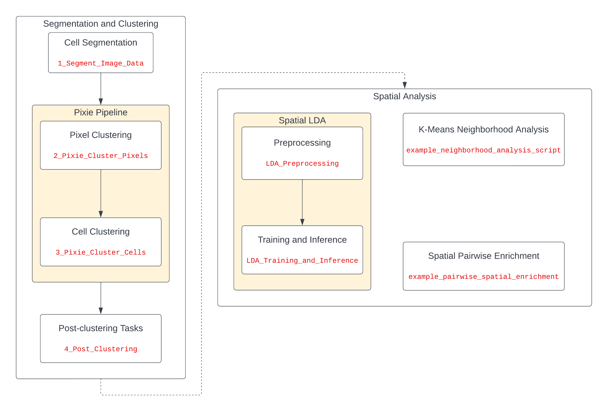

[](https://github.com/angelolab/ark-analysis/actions/workflows/ci.yml)
[](https://coveralls.io/github/angelolab/ark-analysis?branch=main)

[](https://ark-analysis.readthedocs.io/en/latest/)

# ark-analysis

Toolbox for analyzing multiplexed imaging data.

Full documentation for the project can be found [here](https://ark-analysis.readthedocs.io/en/latest/).

## Table of Contents
- [Pipeline Flowchart](#pipeline-flowchart)
- [Getting Started](#getting-started)
  - [Overview](#overview)
    - [1. Segmentation](#1-segmentation)
    - [2. Pixel clustering with Pixie](#2-pixel-clustering-with-pixie)
    - [3. Cell clustering with Pixie](#3-cell-clustering-with-pixie)
    - [4. Post clustering tasks](#4-post-clustering-tasks)
    - [5. Spatial analysis](#5-spatial-analysis)
  - [Installation Steps.](#installation-steps)
    - [Download the Repo](#download-the-repo)
    - [Setting up Docker](#setting-up-docker)
    - [Running on Windows](#running-on-windows)
    - [Using the Repository (Running the Docker)](#using-the-repository-running-the-docker)
- [External Tools](#external-tools)
  - [Mantis Viewer](#mantis-viewer)
    - [Mantis directory structure](#mantis-directory-structure)
    - [Loading image-specific files](#loading-image-specific-files)
    - [Loading project-wide files](#loading-project-wide-files)
    - [View cell features](#view-cell-features)
  - [External Hard Drives and Google File Stream](#external-hard-drives-and-google-file-stream)
- [Updating the Repository](#updating-the-repository)
- [Example Dataset](#example-dataset)
- [Questions?](#questions)
- [Want to contribute?](#want-to-contribute)
- [How to Cite](#how-to-cite)


## Pipeline Flowchart



## Getting Started

### Overview
This repo contains tools for analyzing multiplexed imaging data. The assumption is that you've already performed any necessary image processing on your data (such as denoising, background subtraction, autofluorescence correction, etc), and that it is ready to be analyzed. For MIBI data, we recommend using the [toffy](https://github.com/angelolab/toffy) processing pipeline.

We have recorded workshop talks which complement the repository. [MIBI Workshop Playlist](https://youtube.com/playlist?list=PLjNbkEm4vA26o5YvWKeyHXF8HjTJc7yB0).

#### 1. Segmentation  
The [**segmentation notebook**](./templates/1_Segment_Image_Data.ipynb) will walk you through the process of using [Mesmer](https://www.nature.com/articles/s41587-021-01094-0) to segment your image data. This includes selecting the appropriate channel(s) for segmentation, running your data through the network, and then extracting single-cell statistics from the resulting segmentation mask. [Workshop Talk - Session V - Part 1: Segmentation](https://youtu.be/4_AJxrxPYlk?t=231)
  - *Note:* It is assumed that the cell table uses the default column names as in `ark/settings.py`. Refer to the [docs](docs/_rtd/data_types.md) to get descriptions of the cell table columns, and methods to adjust them if necessary.

#### 2. Pixel clustering with Pixie  
The first step in the [Pixie](https://www.biorxiv.org/content/10.1101/2022.08.16.504171v1) pipeline is to run the [**pixel clustering notebook**](./templates/2_Pixie_Cluster_Pixels.ipynb). The notebook walks you through the process of generating pixel clusters for your data, and lets you specify what markers to use for the clustering, train a model, use it to classify your entire dataset, and generate pixel cluster overlays. The notebook includes a GUI for manual cluster adjustment and annotation. [Workshop Talk - Session IV - Pixel Level Analysis](https://youtu.be/e7C1NvaPLaY)

#### 3. Cell clustering with Pixie  
The second step in the [Pixie](https://www.biorxiv.org/content/10.1101/2022.08.16.504171v1) pipeline is to run the [**cell clustering notebook**](./templates/3_Pixie_Cluster_Cells.ipynb). This notebook will use the pixel clusters generated in the first notebook to cluster the cells in your dataset. The notebook walks you through generating cell clusters for your data and generates cell cluster overlays. The notebook includes a GUI for manual cluster adjustment and annotation. [Workshop Talk - Session V - Cell-level Analysis - Part 2: Cell Clustering](https://youtu.be/4_AJxrxPYlk?t=2704)

#### 4. Post Clustering Tasks
After the Pixie Pipeline, the user can inspect and fine tune their results with the [**post clustering notebook**](./templates/4_Post_Clustering.ipynb). This notebook will go over cleaning up artifacts left from clustering, and working with functional markers.

#### 5. Spatial Analysis  
[Workshop Talk - Session VI - Spatial Analysis - Part 1: Choosing the Right Analysis Tool](https://youtu.be/HQAkS7kbzH8).

  1. **Pairwise Enrichment Analysis**

     The [**pairwise enrichment notebook**](templates/example_pairwise_spatial_enrichment.ipynb) allows the user to investigate the
     interaction between the phenotypes present in their data. In addition users can
     cluster based on phenotypes around a particular feature such as *artery* or *gland*. [Workshop Talk - Session VI - Spatial Analysis - Part 2: Pairwise Spatial Enrichment](https://youtu.be/HQAkS7kbzH8?t=619).

  2. **K-means Neighborhood Analysis**

     The [**neighborhood analysis notebook**](templates/example_neighborhood_analysis_script.ipynb) sheds light on neighborhoods made of micro-environments which consist of a collection of cell phenotypes. [Workshop Talk - Session VI - Spatial Analysis - Part 3: K-means Neighborhood Analysis](https://youtu.be/HQAkS7kbzH8?t=2117).

  1. **Spatial LDA**

     The [**preprocessing**](templates/LDA_Preprocessing.ipynb) and [**training / inference**](templates/LDA_Training_and_Inference.ipynb) draws from language analysis, specifically topic modelling. Spatial LDA overlays a probability distribution on cells belonging to a any particular micro-environment. [Workshop Talk - Session VI - Spatial Analysis - Part 4: Spatial LDA](https://youtu.be/HQAkS7kbzH8?t=3087).


### Installation Steps


#### Pip Installation

You can install the latest version of `ark` with:

```sh
pip install ark-analysis
```

However, the repository will still need to be cloned if you wish to use the Jupyter Notebooks.

#### Download the Repo

We recommend using the latest release of `ark`. You can find all the versions available in the [Releases Section](https://github.com/angelolab/ark-analysis/releases).
Open terminal and navigate to where you want the code stored. 

Currently, the latest release is `v0.6.3`.
Then install the latest release with:

```sh
git clone -b v0.6.3 https://github.com/angelolab/ark-analysis.git
```

You may also install previous releases by simply changing the version after the `-b`.

#### Setting up Docker

There is a complementary [setup video](https://youtu.be/EXMGdi_Izdw).

Next, you'll need to download Docker Desktop:
 - First, [download](https://hub.docker.com/?overlay=onboarding) Docker Desktop. 
 - Once it's sucessfully installed, make sure it is running by looking in toolbar for the Docker whale icon. 


#### Running on Windows

Our repo runs best on Linux-based systems (including MacOS). If you need to run on Windows, please consult our [Windows guide](https://ark-analysis.readthedocs.io/en/latest/_rtd/windows_setup.html) for additional instructions.

#### Using the Repository (Running the Docker)

Enter the following command into terminal from the same directory you ran the above commands:

```
./start_docker.sh
``` 

If running for the first time, or if our Docker image has updated, it may take a while to build and setup before completion. 

This will generate a link to a Jupyter notebook. Copy the last URL (the one with `127.0.0.1:8888` at the beginning) into your web browser. 

Be sure to keep this terminal open.  **Do not exit the terminal or enter `control-c` until you are finished with the notebooks**. 

**NOTE:**

If you already have a Jupyter session open when you run `./start_docker.sh`, you will receive a couple additional prompts.

Copy the URL listed after `Enter this URL instead to access the notebooks:` 

You will need to authenticate. Note the last URL (the one with `127.0.0.1:8888` at the beginning), copy the token that appears there (it will be after `token=` in the URL), paste it into the password prompt of the Jupyter notebook, and log in.

You can shut down the notebooks and close docker by entering `control-c` in the terminal window.

**REMEMBER TO DUPLICATE AND RENAME NOTEBOOKS**

If you didn't change the name of the notebooks within the `templates` folder, they will be overwritten when you decide to update the repo. Read about updating Ark [here](#updating-the-repository)

## External Tools

### Mantis Viewer
[Mantis](https://mantis.parkerici.org/) is a multiplexed image viewer developed by the Parker Institute. It has built in functionality for easily
viewing multichannel images, creating overlays, and concurrently displaying image features alongisde raw channels. We have found it to be extremely useful for analying the output of our analysis pipeline. There are detailed instructions on 
their [download page](https://github.com/ParkerICI/mantis-viewer/releases) for how to install and use the tool. Below are some details specifically related to how we use it in `ark`. [Workshop Talk - Session V - Cell-level Analysis - Part 3: Assessing Accuracy with Mantis Viewer](https://youtu.be/4_AJxrxPYlk?t=4639).

#### Mantis directory structure
Mantis expects image data to have a specific organization in order to display it. It is quite similar to how MIBI data is already stored, 
with a unique folder for each FOV and all channels as individual tifs within that folder. Any notebooks that suggest using Mantis Viewer to inspect results
will automatically format the data in the format shown below. 


```sh
mantis
│ 
├── fov0
│   ├── cell_segmentation.tiff
│   ├── chan0.tiff
│   ├── chan1.tiff
│   ├── chan2.tiff
│   ├── ...
│   ├── population_mask.csv
│   └── population_mask.tiff
├── fov1
│   ├── cell_segmentation.tiff
│   ├── chan0.tiff
│   ├── chan1.tiff
│   ├── chan2.tiff
│   ├── ...
│   ├── population_mask.csv
│   └── population_mask.tiff
└── marker_counts.csv

```

#### Loading image-specific files
In addition to the images, there are additional files in the directory structure which can be read into mantis.  

`cell_segmentation`: This file contains the predicted segmentation for each cell in the image, and allows mantis to identify individual cells.

`population_pixel_mask`: This file maps the individual pixel clusters generated by Pixie in the [pixel clustering notebook](link) to the image data. 

`population_cell_mask`: Same as above, but for cell clusters instead of pixel clusters

These files should be specified when first initializing a project in mantis as indicated below:


#### Loading project-wide files
When inspecting the output of the clustering notebooks, it is often useful to add project-wide .csv files, such as `marker_counts.csv`. These files contain 
information, such as the average expression of a given marker, across all the cells in the project. Project-wide files can either be loaded at project initialization, as shown below:


Or they can be loaded into an existing project via Import -> Segment Features -> For project from CSV


#### View cell features
Once you have loaded the project-wide files into Mantis, you'll need to decide which of the features you want to view. 
Click on `Show Plot Plane` at the bottom right, then select the marker you want to assess. This will then allow you to view
the cell expression of that marker when you mouse over the cell in Mantis. 


### External Hard Drives and Google File Stream

To configure external hard drive (or google file stream) access, you will have to add this to Dockers file paths in the Preferences menu. 

On Docker for macOS, this can be found in Preferences -> Resources -> File Sharing.  Adding `/Volumes` will allow docker to see external drives 

On Docker for Windows with the WSL2 backend, no paths need to be added.  However, if using the Hyper-V backend, these paths will need to be added as in the macOS case.


Once the path is added, you can run:
```
bash start_docker.sh --external 'path/added/to/preferences'
```
or
```
bash start_docker.sh -e 'path/added/to/preferences'
```

to mount the drive into the virtual `/data/external` path inside the docker.

## Updating the Repository

This project is still under development, and we are making frequent changes and improvements. If you want to update the version on your computer to have the latest changes, perform the following steps. Otherwise, we recommend waiting for new releases.

First, get the latest version of the repository.

```
git pull
```

Then, run the command below to update the Jupyter notebooks to the latest version
```
./start_docker.sh --update
```
or
```
./start_docker.sh -u
```

If you have made changes to these notebooks that you would like to keep (specific file paths, settings, custom routines, etc), rename them before updating! 

For example, rename your existing copy of `1_Segment_Image_Data.ipynb` to `1_Segment_Image_Data_old.ipynb`. Then, after running the update command, a new version of `1_Segment_Image_Data.ipynb` will be created with the newest code, and your old copy will exist with the new name that you gave it. 

After updating, you can copy over any important paths or modifications from the old notebooks into the new notebook.

## Example Dataset

If you would like to test out the pipeline, then we have incorporated an example dataset within the notebooks. Currently the dataset contains 11 FOVs with 22 channels (CD3, CD4, CD8, CD14, CD20, CD31, CD45, CD68, CD163, CK17, Collagen1, ECAD, Fibronectin, GLUT1, H3K9ac, H3K27me3, HLADR, IDO, Ki67, PD1, SMA, Vim), and intermediate data necessary for each notebook in the pipeline.

The dataset is split into several smaller components, with each Jupyter Notebook using a combination of those components. We utilize [**Hugging Face**](https://huggingface.co) for storing the dataset and using their API's for creating these configurations. You can view the [dataset](https://huggingface.co/datasets/angelolab/ark_example)'s repository as well.

### Dataset Compartments

**Image Data:** This compartment stores the tiff files for each channel, for every FOV.
```sh
image_data/
├── fov0/
│  ├── CD3.tiff
│  ├── ...
│  └── Vim.tiff
├── fov1/
│  ├── CD3.tiff
│  ├── ...
│  └── Vim.tiff
├── .../
```

**Cell Table:** This compartment stores the various cell tables which get generated by Notebook 1.

```sh
segmentation/cell_table/
├── cell_table_arcsinh_transformed.csv
├── cell_table_size_normalized.csv
└── cell_table_size_normalized_cell_labels.csv
```

**Deepcell Output:** This compartment stores the segmentation images after running deepcell.
```sh
segmentation/deepcell_output/
├── fov0_whole_cell.tiff
├── fov0_nuclear.tiff
├── ...
├── fov10_whole_cell.tiff
└── fov10_nuclear.tiff
```

**Example Pixel Output:** This compartment stores feather files, csvs and pixel masks generated by pixel clustering.

```sh
segmentation/example_pixel_output_dir/
├── cell_clustering_params.json
├── channel_norm.feather
├── channel_norm_post_rowsum.feather
├── pixel_thresh.feather
├── pixel_channel_avg_meta_cluster.csv
├── pixel_channel_avg_som_cluster.csv
├── pixel_masks/
│  ├── fov0_pixel_mask.tiff
│  └── fov1_pixel_mask.tiff
├── pixel_mat_data/
│  ├── fov0.feather
│  ├── ...
│  └── fov10.feather
├── pixel_mat_subset/
│  ├── fov0.feather
│  ├── ...
│  └── fov10.feather
├── pixel_meta_cluster_mapping.csv
└── pixel_som_weights.feather
```

**Example Cell Output:** This compartment stores feather files, csvs and cell masks generated by cell clustering.

```sh
segmentation/example_cell_output_dir/
├── cell_masks/
│  ├── fov0_cell_mask.tiff
│  └── fov1_cell_mask.tiff
├── cell_meta_cluster_channel_avg.csv
├── cell_meta_cluster_count_avg.csv
├── cell_meta_cluster_mapping.csv
├── cell_som_cluster_channel_avg.csv
├── cell_som_cluster_count_avg.csv
├── cell_som_weights.feather
├── cluster_counts.feather
├── cluster_counts_size_norm.feather
└── weighted_cell_channel.csv
```

### Dataset Configurations

* **1 - Segment Image Data:**
  * Image Data
* **2 - Pixie Cluster Pixels:**
  * Image Data
  * Cell Table
  * Deepcell Output
* **3 - Pixie Cluster Cells:**
  * Image Data
  * Cell Table
  * Deepcell Output
  * Example Pixel Output
* **4 - Post Clustering:**
  * Image Data
  * Cell Table
  * Deepcell Output
  * Example Cell Output

## Questions?

If you have a general question or are having trouble with part of the repo, you can refer to our [FAQ](https://ark-analysis.readthedocs.io/en/latest/_rtd/faq.html) or head to the [discussions](https://github.com/angelolab/ark-analysis/discussions) tab to get help. If you've found a bug with the codebase, first make sure there's not already an [open issue](https://github.com/angelolab/ark-analysis/issues), and if not, you can then [open an issue](https://github.com/angelolab/ark-analysis/issues/new/choose) describing the bug.


## Want to contribute?  

If you would like to help make `ark` better, please take a look at our [contributing guidelines](https://ark-analysis.readthedocs.io/en/latest/_rtd/contributing.html). 

## How to Cite
Please directly cite the `ark` repo (https://github.com/angelolab/ark-analysis) if it was a part of your analysis. In addition, please cite the relevant paper(s) below where applicable to your study. 

1. [Greenwald, Miller et al. Whole-cell segmentation of tissue images with human-level performance using large-scale data annotation and deep learning [2021]](https://www.nature.com/articles/s41587-021-01094-0)
2. [Liu et al. Robust phenotyping of highly multiplexed tissue imaging data using pixel-level clustering [2022]](https://www.biorxiv.org/content/10.1101/2022.08.16.504171v1)
