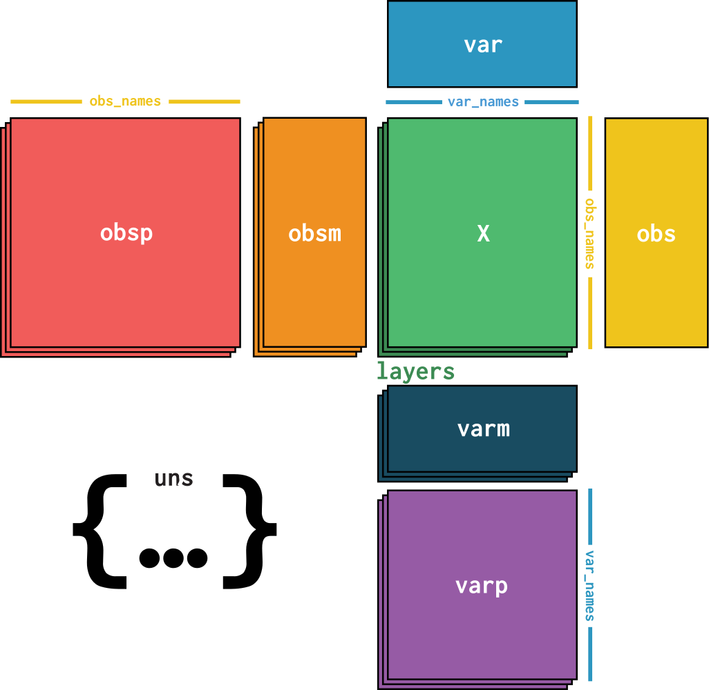

## Data type information

The `ark` repo has different data structures for different data types. Below is a brief glossary highlighting the most important ones. 

---

Name: segmentation labels  
Type: xarray.DataArray  
Created by: [create_deepcell_output](https://ark-analysis.readthedocs.io/en/latest/_markdown/ark.utils.html#ark.utils.deepcell_service_utils.create_deepcell_output)  
Used by: [calc_dist_matrix](https://ark-analysis.readthedocs.io/en/latest/_markdown/ark.utils.html#ark.utils.spatial_analysis_utils.calc_dist_matrix)  
Shape: 4D matrix of fov x num_cells x num_cells x compartment  

Description: This is how segmentation predictions are represented. Each cell is assinged a unique integer value. All of the pixels belonging to that cell have the same value. e.g. all pixels belonging to cell 1 have a value of 1, all pixels belonging to cell 5 have a value of 5, etc. This data structure holds the unique set of labels for each FOV on the first axis. IF there are multiple labels per FOV, for example nuclear and whole-cell, these are stored on the last axis

---

Name: cell table  
Type: pandas.DataFrame  
Created by: [generate_cell_table](https://ark-analysis.readthedocs.io/en/latest/_markdown/ark.segmentation.html#ark.segmentation.marker_quantification.generate_cell_table)   
Used by: [calculate_channel_spatial_enrichment](https://ark-analysis.readthedocs.io/en/latest/_markdown/ark.analysis.html#ark.analysis.spatial_analysis.calculate_channel_spatial_enrichment), [calculate_cluster_spatial_enrichment](https://ark-analysis.readthedocs.io/en/latest/_markdown/ark.analysis.html#ark.analysis.spatial_analysis.calculate_channel_spatial_enrichment),
[create_neighborhood_matrix](https://ark-analysis.readthedocs.io/en/latest/_markdown/ark.segmentation.html#ark.segmentation.marker_quantification.generate_cell_data)  
Shape: 2D matrix of cells x cell_features  

Description: This holds the extracted single cell data. Each row is a unique cell, and each column is a feature for that cell. This includes the counts for each marker, morphological information, and information to link that cell back to the original image such as segmentation id and FOV.  


The default columns of the cell table include:

| cell_size | channel_1 | channel_2 | ... | channel_n | label | area | eccentricity | major_axis_length | minor_axis_length | perimeter | convex_area | equivalent_diameter | centroid-0 | centroid-1 | major_minor_axis_ratio | perim_square_over_area | major_axis_equiv_diam_ratio | convex_hull_resid | centroid_dif | num_concavities | fov | cell_metacluster |


For each cell, the following morphology features calculated from `skimage.measure.regionprops` are included:
* `cell_size`: number of coordinates (pixels) in the cell.
* `channel_1` -> `channel_n`: The amount of signal from that channel in the given cell. The way this is calculated depends on how the cell table was generated. The default is that this is the size-normalized counts, but there is also the option for this to be arcsin-h transformed.
* `label`: A unique numerical label for each cell (row in the cell table).
* `area`: area of the cell.
* `eccentricity`: eccentricity of the ellipse that has the same second-moments as the region. The eccentricity is the ratio of the focal distance (distance between focal points) over the major axis length. The value is in the interval [0, 1). When it is 0, the ellipse becomes a circle.
* `major_axis_length`: the length of the major axis of the ellipse that has the same normalized second central moments as the region.
* `minor_axis_length`: the length of the minor axis of the ellipse that has the same normalized second central moments as the region.
* `perimeter`: perimeter of object which approximates the contour as a line through the centers of border pixels using a 4-connectivity.
* `convex_area`: the area of the convex hull.
* `equivalent_diameter`: the diameter of the circle with the same area as the cell.
* Centroids: Note that all the arrays are NumPy arrays, therefore the origin $(0,0)$ is in the "top-left corner" of the image / array.
  * `centroid-0`: the $y$-coordinate of the centroid.
  * `centroid-1`: the $x$-coordinate of the centroid.
* `fov`: The FOV from which the cell originates from.

The base `regionprops` metric often don't provide enough morphological information about each cell on their own. We add the following derived metrics to provide more complete information about the segmented cells:
* `major_minor_axis_ratio`: the major axis length divided by the minor axis length.
* `perim_square_over_area`: the square of the perimeter divided by the area. 
* `major_axis_equiv_diam_ratio`: the major axis length divided by the equivalent diameter.
* `convex_hull_resid`: the difference between the convex area and the area divided by the convex area.
* `centroid_dif`: the normalized euclidean distance between the cell centroid and the corresponding convex hull centroid.
* `num_concavities`: the number of concavities of the region.
* `nc_ratio`: for nuclear segmentation only. The nuclear area divided by the total area.

If you are using your own spatial analysis tools to generate information for the Cell Table, adjust the following values in `ark/.settings.py`:
* `PRE_CHANNEL_COL`: Set this to be the column name which precedes first channel column.
* `POST_CHANNEL_COL`: Set this to be the column name which comes after the last channel column.

Afterwards the Docker Image can be started with the updated settings.
```sh
start_docker.sh
```

---

Name: distance matrix  
Type: numpy.array  
Created by: [calc_dist_matrix](https://ark-analysis.readthedocs.io/en/latest/_markdown/ark.utils.html#ark.utils.spatial_analysis_utils.calc_dist_matrix)   
Used by: [calculate_channel_spatial_enrichment](https://ark-analysis.readthedocs.io/en/latest/_markdown/ark.analysis.html#ark.analysis.spatial_analysis.calculate_channel_spatial_enrichment), [calculate_cluster_spatial_enrichment](https://ark-analysis.readthedocs.io/en/latest/_markdown/ark.analysis.html#ark.analysis.spatial_analysis.calculate_channel_spatial_enrichment)  
Shape: 2D matrix of num_cells x num_cells  

Description: Many of the spatial analysis functions in the `analysis` module use distances between cells to compute interesting spatial properties. The distance matrix holds that information. Each matrix is a square array, where the value of cell (**i**, **j**) in the matrix represents the distance between cell **i** and cell **j**.  

Note: `calc_dist_matrix` produces a dictionary of distancs matrixes; each distance matrix takes the form described above

---

Name: generalized cell clustering inputs  
Type: pandas.DataFrame  
Created by: user  
Used by: [generic_cell_clustering.ipynb](https://github.com/angelolab/ark-analysis/blob/main/templates/generic_cell_clustering.ipynb)  

Shape: 2D matrix of num_cells x num_expression_columns  

Description: users may want to run cell clustering on custom expression inputs outside of pixel cluster counts. The input data will need to be defined as a CSV to support DataFrame operations.

The CSV should contain the following columns

* `fov`: name of the FOV the cell comes from
* `label`: the name of the segmentation label
* A set of expression columns defining the properties of each cell desired for clustering

---

Name: AnnData   
Type: anndata.AnnData   
Created by: [ConvertToAnnData](https://ark-analysis.readthedocs.io/en/latest/_markdown/ark.utils.html#ark.utils.data_utils.ConvertToAnnData)    
Used by: [anndata_conversion.ipynb](https://github.com/angelolab/ark-analysis/blob/main/templates/anndata_conversion.ipynb)

<p align="center">
  
</p>


`AnnData` is a data structure consisting of matrices, annotated by DataFrames and Indexes.

A `AnnData` object is composed of the following components:

- **X**
- **var**
- **obs**
- **obsm**
- **obsp**
- **varm**
- **varp**

Each of these components have specific use cases and will be described below:

#### 1. X, var, obs

<p align="center">
  
</p>

- `X` is a matrix of shape `(n_obs, n_vars)` where `n_obs` is the number of observations and `n_vars` is the number of variables. 
- `var` is a `DataFrame` of shape `(n_var_features, n_vars)`, where the index is `var_names`. This `DataFrame` contains attributes of each variable.
- `obs` is a `DataFrame` of shape `(n_obs, n_obs_features)`, where the index is `obs_names`. This `DataFrame` contains information about each observation, such as numeric metrics from `regionprops` or categorical data such as cell phenotype, or patient-level information.
- `n_obs` is the number of segmented regions or objects of interest. These can be cell segmentations, or more complex objects such as nuclei masks, or object masks. Whatever it is, it should be the smallest, most atomic unit of analysis.
- `obs_names` is a `Pandas` Index where each value is a unique identifier for each observation. These are the names of the segmented regions, and should be unique.
- `n_vars` is the number of variables, and in this case it is the number of channels. Each channel is a variable, and each observation has a value for each channel.
- `var_names` is a `Pandas` Index where each value is a unique identifier for each variable. These are the names of the channels and should be unique.

#### 2. obsm, varm

<p align="center">
  
</p>

- `obsm` is a Matrix of shape `(n_obs, a)`, where `a` is an integer. This contains observation level matrices, and we use a mapping `str -> NDArray` to store them. For example, `X_umap`
would store the UMAP embedding of the sparse matrix `X`, and `X_pca` would store the PCA embedding of `X`.
- `varm` is a Matrix of shape `(n_vars, b)`, where `b` is an integer. This contains variable level matrices, and we use a mapping `str -> NDArray` to store them. For example, `Marker_umap` would store the UMAP embedding of the matrix `var`.


#### 3. obsp, varp

<p align="center">
  
</p>

- `obsp` is a square matrix of shape `(n_obs, n_obs)`, and its purpose is to store pairwise computations between observations.
- `varp` is a square matrix of shape `(n_vars, n_vars)`, and its purpose is to store pairwise computations between variables.
#### 4. **uns**

<p align="center">
  
</p>

- `uns` is a free slot for storing *almost* anything. It's a mapping from a string label to anything.
